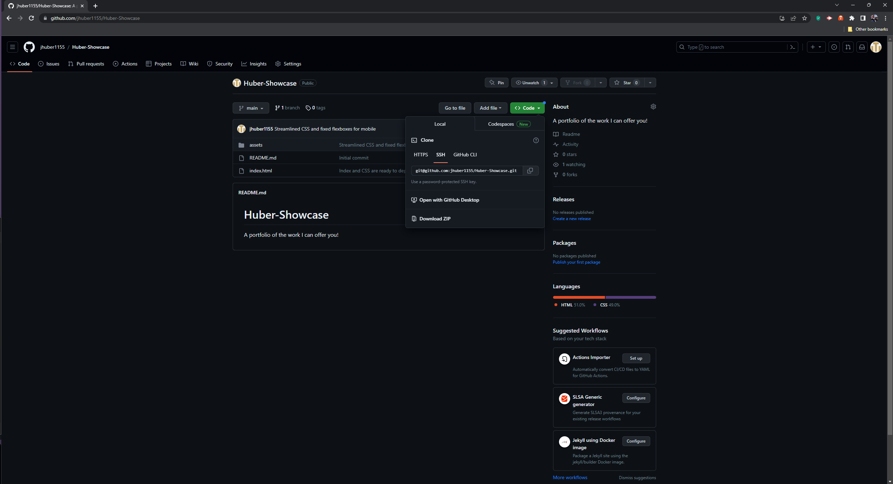

# Tech-Blog

## Description

This project was a great way to teach us about how to merge the front and back ends of a full-stack development together. We used models to create relationships of data and then stored that data in a database. We then manipulated that data in the form of controllers and API calls through our index.js and homeRoutes. With these API calls, we were able to create blog posts and comments to those posts. We were also able to authenticate our users with a login and log out by using our Auth helper function to ensure that the user was logged-in in order to view and create content. This blog post project is a great example of how we can utilize our full-stack coding capabilities.

## Installation

Go to [Github](www.github.com)  and then clone the code of the repository.

Open using your preferred code editing environment. Then open the integrated terminal and run the code!

## Usage

Unfortunately I was unable to complete this code. There is still some work to do on the front-end coding when it comes to the login.js and profile.js files respectively. This code will be completed in the near future!

## Credits
I would like to thank the staff and my fellow students at the UCLA Bootcamp in helping me gain an understanding when it comes to deploying the front and back-end services together to make a coherent and cogent website. I have learned a lot and expect to learn a lot more in the future! I would also like to credit the X-pert Learner software and AskBCS tutors who helped me troubleshoot along the way!

